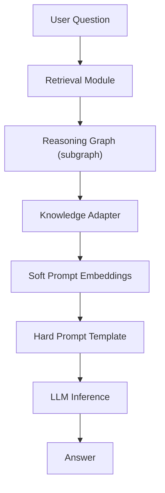
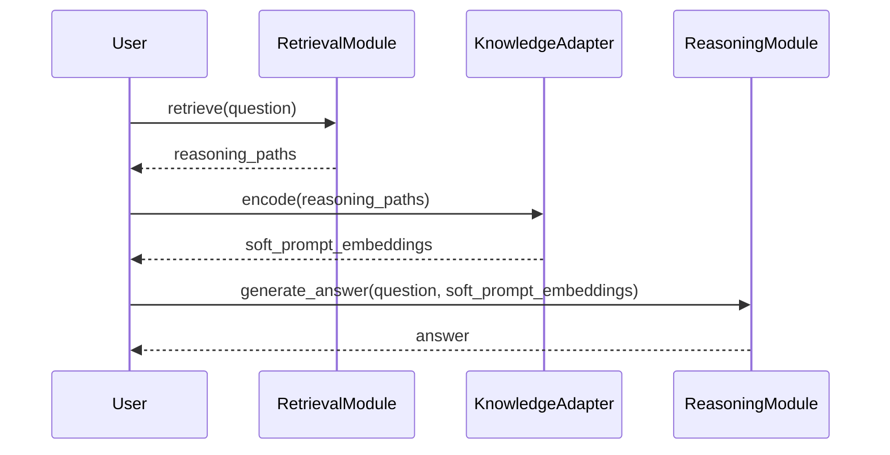

# GraphPromptor: A Lightweight Reasoning Framework for LLMs on Knowledge Graphs

## 1. Overview

**GraphPromptor** is a lightweight, efficient reasoning framework based on the "Retrieve → Embed → Reason" methodology described in the paper:

[LightPROF: A Lightweight Reasoning Framework for Large Language Model on Knowledge Graph](https://arxiv.org/abs/2504.03137)

It enables Large Language Models (LLMs), like Gemini 2.5-Flash, to perform complex reasoning over external Knowledge Graphs (KGs) without full model fine-tuning.

### Target Audience

This document is intended for technical users interested in understanding and using the GraphPromptor project.

By freezing LLM parameters and only training a compact Knowledge Adapter, GraphPromptor delivers high accuracy, efficient memory usage, and faster inference.

**Key features:**

- Multi-hop reasoning with minimal token overhead
- Soft prompt generation by combining graph structure and textual information
- Compatibility with open-source and commercial LLMs
- Flexible knowledge graph backends (NetworkX first, scalable to DGL-KE/PyG)
- Modular design for easy extensions

## 2. Getting Started

This section guides you through setting up and running GraphPromptor.

### Cloning the Repository

Clone the GraphPromptor repository from GitHub:

```bash
git clone https://github.com/AetherForge/GraphPromptor.git
cd GraphPromptor
```

### Installing Dependencies

Install the required Python packages using pip:

```bash
pip install -r requirements.txt
```

### Setting Environment Variables

Some components, particularly the Reasoning Module, may require API keys or other configuration via environment variables.

- **Required Variables:** (List specific required variables here, e.g., `GEMINI_API_KEY`)
- **How to Set:** You can set these variables in your shell or use a `.env` file and a library like `python-dotenv`.

## 3. Architecture



- **Retrieval Module**: Predicts the number of hops needed for reasoning and extracts a focused reasoning graph.
- **Knowledge Adapter**: Converts the reasoning subgraph into compact, fused embeddings that match the LLM input space.
- **Reasoning Module**: Combines hard prompts and soft prompts to guide the frozen LLM to infer the final answer.


*Diagram illustrating the interaction flow between modules and the KG backend.*

## 3. Design Details

| Component | Inputs | Outputs | Description |
|:---|:---|:---|:---|
| RetrievalModule | question (str) | List of paths [(h,r,t)…] | Hop prediction + constrained BFS sampling |
| KnowledgeAdapter | List of paths | Tensor [N×E] | Fusion of structure and text embeddings |
| ReasoningModule | question, soft prompts | answer (str) | Inference through hard + soft prompting |

**Training Strategy:**

- Only the Knowledge Adapter and Projector layers are trainable.
- Loss: Cross-entropy next-token prediction based on correct answers.
- Soft Prompt: Compact representation injected into LLM input embeddings.

## 4. Detailed Workflow

### 4.1 KG Loading

- Triples are loaded into a NetworkX DiGraph with (head, relation, tail) format.
- Edge attributes store relation types.

### 4.2 Retrieval Stage

- Fine-tuned hop predictor (based on a BERT encoder) infers expected hop count.
- Named entity recognition or simple matching identifies anchor entities.
- Constrained BFS up to hop depth is performed.
- Top-K reasoning paths are ranked based on semantic relevance.

### 4.3 Knowledge Adapter Stage

- Each triple is tokenized and embedded via a frozen BERT encoder.
- Structural information (triple pattern) is encoded through a small MLP.
- Structural and textual embeddings are fused and projected into the LLM's token space.

### 4.4 Reasoning Stage

- Hard prompts define the context/instructions.
- Soft prompts (knowledge embeddings) are inserted between system/user messages.
- LLM inference generates the answer in a fully frozen manner.



## 6. Usage Example

This section provides a basic example. For a more detailed and interactive demonstration, please refer to the `notebooks/demo.ipynb` file.

```python
from lightprof.utils import load_kg_from_triples, get_gemini_tokenizer
from lightprof.retrieval import RetrievalModule
from lightprof.adapter import KnowledgeAdapter
from lightprof.reasoning import ReasoningModule

# 1. Load Knowledge Graph
kg = load_kg_from_triples('data/freebase_triples.tsv')

# 2. Initialize Modules
tokenizer = get_gemini_tokenizer()
hop_predictor = ...  # Your trained hop predictor
retriever = RetrievalModule(kg, hop_predictor, tokenizer)
adapter = KnowledgeAdapter('bert-base-uncased', struct_emb_dim=128, llm_embed_dim=512)
reasoner = ReasoningModule('gemini-2.5-flash-preview-04-17', tokenizer, hard_template="Answer the question: {question}\nGraph info: <soft_prompt>\nAnswer:")

# 3. Run Inference
question = "Which drugs did Lindsay Lohan abuse?"
paths = retriever.retrieve(question)
soft = adapter(paths)
answer = reasoner.answer(question, soft)
print(answer)
```

## 6. Folder Structure

```bash
GraphPromptor/
├── README.md            # Project overview
├── requirements.txt     # Python dependencies
├── data/                # Knowledge Graph triples
│   ├── freebase_triples.tsv
│   └── webqsp.jsonl
├── lightprof/
│   ├── __init__.py
│   ├── utils.py         # Loaders, tokenizers
│   ├── retrieval.py     # Retrieval logic
│   ├── adapter.py       # Knowledge Adapter module
│   ├── reasoning.py     # Reasoning through LLM
│   └── train.py         # Training loop for Adapter
├── scripts/             # KG conversion utilities
└── notebooks/           # Example workflows
    └── demo.ipynb
```

## 8. Critical Considerations

### 7.1 LLM Selection

| Model | Context Window | Pros | Cons |
|:---|:---|:---|:---|
| Gemini 2.5-Flash | 1M tokens | Fast, low cost, long input | Limited fine-grain control |
| GPT-4.1 | 32K tokens | Strong reasoning | High cost |
| O4-mini | 128K tokens | Low cost, decent performance | More hallucination risk |

**Recommendation:** Start with Gemini 2.5-Flash for efficient large context multi-hop QA.

### 7.2 KG Backend Selection

| Backend | Scale | Pros | Cons |
|:---|:---|:---|:---|
| NetworkX | Small/medium (up to 1M triples) | Fast prototyping, easy BFS | Memory-bound |
| DGL-KE | Large (10M+ triples) | GPU-accelerated embeddings | Higher complexity |
| Neo4j | Enterprise-scale | Indexing, clustering | Requires server infra |

**Recommendation:** Start with NetworkX, migrate to DGL-KE when scaling.

### 7.3 Training Loop

- **Soft-prompt only:** Lightweight, easy to tune.
- **LoRA augmentation (optional):** Boosts reasoning depth if necessary.
- **Optimizer:** AdamW with a cosine scheduler.
- **Learning Rate:** ~2e-3 (for soft prompt adapters).

## 9. Contribution Guidelines

We welcome contributions to GraphPromptor! Please follow these guidelines:

- **Reporting Bugs:** If you find a bug, please open an issue on GitHub with a clear description and steps to reproduce.
- **Suggesting Features:** For new features or improvements, open an issue to discuss your ideas before submitting a pull request.
- **Submitting Pull Requests:**
  - Fork the repository and create a new branch for your changes.
  - Ensure your code adheres to any existing code style guidelines.
  - Write clear and concise commit messages.
  - Submit a pull request to the `main` branch.
- **Code Style:** (Mention or link to code style guidelines if they exist)

## 10. Troubleshooting / FAQ

This section will be populated over time with common issues, errors, and their solutions based on user feedback.

## 11. Future Enhancements

- Plug-and-play for multiple LLM backends (OpenAI, Anthropic, Cohere)
- KG streaming retrieval for extremely large graphs
- Cross-modal Knowledge Adapter (images, tables)
- Multi-agent Reasoning Chains over Knowledge Graphs

## 12. Conclusion

GraphPromptor provides a powerful starting point for extending LLMs with up-to-date, structured knowledge reasoning—efficiently, modularly, and scalably.
